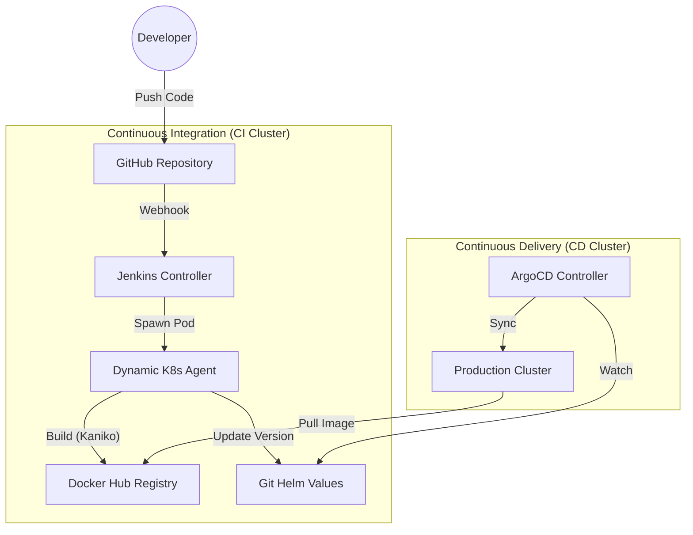

# ⚓ Enterprise K8s Platform: GitOps & CI/CD


## 💡 About the Project

**Enterprise K8s Platform** is a simulation of a corporate-grade DevOps environment focused on **Scalability**, **Security**, and **GitOps** principles.

Unlike typical cloud-native pipelines (e.g., GitHub Actions), this project implements a **Self-Hosted** CI/CD solution running entirely within a Kubernetes cluster. The goal was to build a robust **Zero-Touch Deployment** pipeline where the state of the production cluster is automatically synchronized with the Git repository.

The platform features a **Self-Hosted CI Server (Jenkins)** running inside Kubernetes, utilizing **Dynamic Ephemeral Agents** for isolated and resource-efficient builds.

---

## 🏗️ System Architecture

The project demonstrates a full **GitOps** workflow using **Jenkins** for Continuous Integration and **ArgoCD** for Continuous Delivery.

---

## 🚀 Key Features & Competencies

### 1. GitOps with ArgoCD (Continuous Delivery)
* **Single Source of Truth:** The entire cluster state is defined in Git. Manual changes to the cluster are detected as "Drift" and automatically reverted (**Self-Healing**).
* **Automated Sync:** ArgoCD monitors the Helm Chart repository and automatically deploys new versions of the application upon configuration changes (triggered by Jenkins).

### 2. Scalable CI with Jenkins on Kubernetes
* **Dynamic Provisioning:** Jenkins is configured to use **Kubernetes Cloud**. It does not use static build agents. Instead, it dynamically spawns **Ephemeral Pods** for each build job.
* **Cost Efficiency:** Agents exist only during the build execution and are destroyed immediately after, ensuring **zero resource waste** when idle.

### 3. Secure Daemonless Builds (Kaniko)
* **No Docker-in-Docker:** Implemented **Kaniko** to build container images inside the Kubernetes cluster.
* **Security:** This approach eliminates the need for privileged containers or mounting the host Docker socket, adhering to strict enterprise security standards (Rootless Builds).

### 4. Zero-Touch Deployment
* **Full Automation loop:**
    1. Code Commit triggers Jenkins.
    2. Jenkins builds image & pushes to DockerHub.
    3. **Jenkins commits new version tag** to `values.yaml` in Git.
    4. ArgoCD detects the change and updates the Cluster.
    * *No manual kubectl commands required.*

---

## 🛠️ Tech Stack

| Category | Technology | Usage |
| :--- | :--- | :--- |
| **Orchestration** | **Kubernetes** (Minikube) | Infrastructure layer managed via `kubectl`. |
| **CI Server** | **Jenkins** (Helm deployed) | Orchestrating build pipelines using Groovy `Jenkinsfile`. |
| **CD / GitOps** | **ArgoCD** | Managing application state and deployments. |
| **Build Tool** | **Kaniko** | Building Docker images inside K8s pods. |
| **Package Manager** | **Helm** | Templating Kubernetes manifests (`charts/`). |
| **App Logic** | **Python (Flask) + Redis** | Demo stateful microservice ("Hit Counter"). |

---

## 📂 Project Structure

```text
enterprise-k8s-platform/
├── app/                 # Source code of the Python Application
│   ├── Dockerfile       # App container definition
│   └── app.py           # Flask logic + Redis connection
├── charts/              # Helm Charts (Infrastructure Definition)
│   └── hit-counter/     # Custom Chart for the app
│       ├── templates/   # K8s Manifests (Deployment, Service)
│       └── values.yaml  # Configuration (Single Source of Truth)
├── Jenkinsfile          # Pipeline as Code (Groovy script)
└── README.md            # Documentation
```
---

## 📸 Gallery

The screenshots below present key system elements in action.

| Jenkins Dynamic Agents | ArgoCD GitOps Sync |
| :---: | :---: |
|  | [ |
| *Jenkins spawning a temporary Pod to execute the pipeline.* | *ArgoCD visualizing the application tree and sync status.* |

---

## 💻 How to run locally?

### Prerequisites
* Docker Desktop & Minikube
* Helm & kubectl

### 1. Start the Cluster
```bash
minikube start --driver=docker
minikube tunnel # Keep this running for LoadBalancer support
```

### 2. Deploy Jenkins (Infrastructure)
```bash
helm repo add jenkins [https://charts.jenkins.io](https://charts.jenkins.io)
helm repo update
helm install jenkins jenkins/jenkins --set controller.serviceType=LoadBalancer
```
*Access Jenkins at:* `minikube service jenkins`

### 3. Deploy ArgoCD (GitOps Controller)
```bash
kubectl create namespace argocd
helm repo add argo [https://argoproj.github.io/argo-helm](https://argoproj.github.io/argo-helm)
helm install argocd argo/argo-cd --namespace argocd
```
*Access ArgoCD via port-forward:* `kubectl port-forward svc/argocd-server -n argocd 8081:443`

### 4. Configure Pipelines
* Connect Jenkins to the GitHub repository using **Deploy Keys**.
* Configure Kubernetes Secrets for Docker Hub (`dockerhub-secret`) and Git SSH (`git-ssh-key`).
* Connect ArgoCD to the `charts/hit-counter` path in the repository.

---

## 📬 Contact

**Adam Skorus**
*Junior DevOps Engineer / Cloud Enthusiast*

I am eager to discuss Kubernetes architectures, CI/CD optimization, and GitOps practices.

🔗 **LinkedIn:** [linkedin.com/in/adamskorus](https://linkedin.com/in/adamskorus)
🐙 **GitHub:** [github.com/fearly231](https://github.com/fearly231)

---
*Project created for educational purposes, demonstrating an Enterprise-grade CI/CD path.*
